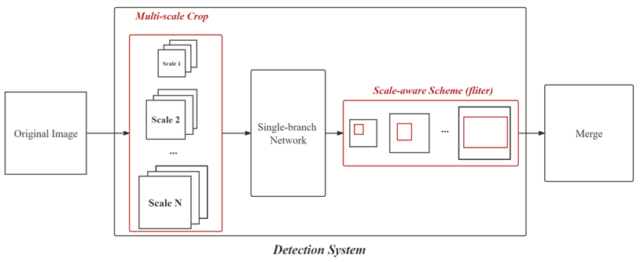
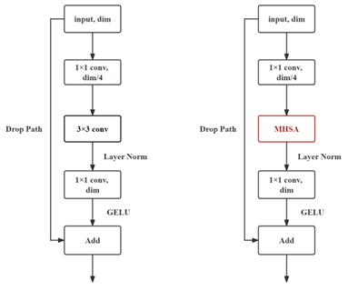

# Multi-scale Detection with Attention Mechanism for High-Resolution Images

Code for thesis. According to the current research about object detection, this thesis focus on 2 problems. 
```
1. High resolution image and Multi-scale scenario
2. Current ViTs can not apply MHSA at the early stage of backbone.
```

Based on these 2 problems, two challenges then raise:
```
1. Can we conveniently increase the bandwidth of a system to make it suitable for large-scale variation?

2. Can we efficiently extract global information using attention mechanism at the early stage of a network?
```

According to these questions, I mainly proposed 2 methods to adress them.
```
1. Multi-scale scheme.  
2. Light multi-head self-attention.  
```
---

## Multi-scale scheme
The original dataset is DOTA v1.0. The original train set will be used as train and val set. The original val set will be treated as test set.



For multi-scale crop training, the original train set is cropped into 2 scales:  
```
subsize = 640, overlap = 50
subsize = 1280, overlap = 100
```

For multi-scale crop evaluateing, the original val set is cropped into 3 scales:
```
subsize = 640, overlap = 50
subsize = 1280, overlap = 100
```

The model is trained and evaluated on `MULTICROPPED_DOTA` dataset.

And in order to evaluate the influence brought by `Multi-scale crop`, the model also trained under `SINGLECROPPED_DOTA` to perform a baseline. The cropping params are listed blow.  
```
Single scale crop, applied on train, val and test set.
subsize = 1024, overlap = 50
```
After cropping the images, the images without objects are removed. This process is quite significant, reduces the dataset size by over 30%.  

About how to processing the data, refer to another project `DOTA-processing`.

---

## Light Multi-head self-attention (AttentionBlock) 
Using attention in traditional convolution network is a trend now. However, it is hard to apply attention at the shallow layer of backbone due to the huge computation.

So, in this project, we proposed a new attention mechanism, which is light enough to be implemented at the shallow stage of a network.

The detail of this method will update soon.



---

## Usage
The label format is using VOC-style. So, first transform the annotations into `xml` file.

To set the training scheduel, go to `configure.py`, almos every training paramaters are in this script.

Run `train.py` to train the model. If train a model from very begining (do not pre-trained backbone or pre-trained model), set the `epoch` to some big value, such as 500. If use pre-trained backbone or model, `epoch` can be set to some small value to save the time, such as 300.

To evaluate the model, run `get_map.py`. The evaluateing params (such like mAP threshold) are independent from `configure.py`, please directly set them in `get_map.py`.
